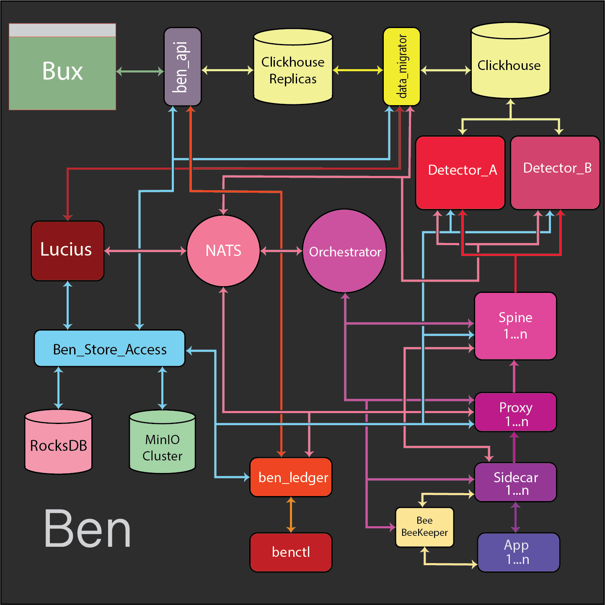

# Ben At a Glance

---

### **NOTE**:
NATS is not a god object. I feel I did a bad job with the visual diagrams.
NATS does the following:
- NATS distributes schema/config/policy pack change notifications by fanning out messages
- NATS delivers signals from detectors to sidecars
- In the instance that the system goes down, components send “hello” messages to NATS which keeps attempting to deliver to
  the orchestrator until it is online, at which point the orchestrator resumes lifecycle management.
- NATS does not handle or deliver health messages
- NATS does not participate in health evaluation
- NATS does not carry bulk data
- NATS does not make lifecycle decisions
- NATS does not sit on the data hot path
  
Ideally, NATS is generally low throughput (as opposed to the rest of the system). Data travels up through the hot path.
I just wanted to add that because I got feedback that from the diagrams NATS looks way more involved than it is.

---

Ben is an observability and integrated security platform. As stated in [philosophy](./01-philosophy.md), Ben's goal is 
to be an intent driven integrated platform based on compile time contracts. This part of the document repo
aims to show, illuminate and discuss a high level overview of the system. Within this markdown file the authority,
responsibility and boundary of system components will be discussed at a high level.

## Ben at a high level

## System by piece

### benctl
benctl is the command line utility that establishes coded contracts and configuration for Ben. benctl inspects, build and deploys schemas, policy packs, signals, playbooks, proxy/sidecar configurations. It is the "entry point" to establish what ben sees, looks for and knows as intent. benctl is scriptable and notifies when contract/intent/compile tim configurationsn are built, deployed, versioned, successfully implemented. 

### ben_ledger
ben_ledger the pre-activation authority for user contracts and the the recovery anchor for user intent. ben_ledger also acts as the single authoritative schema, config and intent source when the Orchestrator spins up spines/proxies/sidecars. ben_ledger is stateful and simple. ben_ledger is not a store, but is a "ledger" or "book keeper" for intent and contracts for the system.

### bux (ben ux)
Bux is the front end application for Ben. Bux is not authoritative. Bux views logs, histograms, events, actions. Bux also retrieves information from ben_ledger to see schemas, playbooks, signals, configurations to test, validate and mitigate potential behavior that is not expected. Bux comes in a desktop application and webview. Read heavy and websocket based.

### ben_api
ben_api is the intermediary between bux and ben_ledger, ClickHouse replicas, and ben_store_access. ben_api communicates with bux through websockets. ben_api does not write schemas, playbooks, signals, or configurations.

### NATS Jestream
NATS Jetsream is the message queue for the system. As the diagram shows, NATS works with the majority of system components. 
Reasons for NATS
- NATS is a presence plane, not a truth plane.
- Push first semantics match reality.
- Fan out without guesswork
- Loss is honest and observable
- Enforces stateless components
- Operationally simple

### Orchestrator
The Orchestrator is the control plane to spin up, tear down and a source of truth for service discovery. It maintains a minimal state in terms of a simple atomic writing table. It also checks on system health. Discovery truth is ephemeral, recomputable and does not survive service failure.

### BEE/BEE Keeper
BEE (Ben Escrow Emissary) is the attestation agent that works between apps and sidecars. 
BEE Keeper is the long running daemon that spins up ephemeral BEEs to hookup new services.

### Sidecars
Sidecars are the "dumb" intermediaries between the app and Ben that communicate with apps through file descriptors. They do send signal to the app, though bounded and intent specific.

### Proxies
Proxies are the intermediary between sidecars and spines. Proxies have 1 configuration, and it is also code-as-configuration. Proxies handle things such backpressure, proxy specific rules, watermark, shedding, coalescing and scaling (not an exhaustive list). Ben has it's own dsl which acts as the configuration of components. Proxies also handle Lucius routing logic for data marked for Lucius.

### Spines
Spines are the action components on data. Spines do rule evaluation through the bitspec engine, redaction through the blot engine and creates metadata on each piece of data for the detectors to use.

### Detectors
Detectors are ML Algorithms which use bounded autonomy to enact playbooks. Detectors give system wide health, information, statistics and insight derived from intent to give a holistic vision of the host system.

### Lucius
Lucius is the santizer and vm orchestration engine to detonate potential malicious data. Lucius has a light scrub route and a deep scrub route.

### ben_store_access
ben_store_access is the data streaming and retrieval intermediary for the RocksDB KV container and the MinIO cluster. 

### data_migrator
The data_migrator is the system to replicate, migrate and establish clickhouse replica data for the front end to relieve the main clickhouse database from calls from the front end that would be resource intensive to keep it off the hot path from the rest of the system. It also acts as the authority to change Clickhouse with user schema inserts/updates and/or migrations.

### Clickhouse
Clickhouse is the main data store for information. 
Reasons for use:
- Built for truth after the fact. analytics are evidence, not truth.
- Append only fits failure honest systems
- Columnar storage
- Loss isn't hiddens
- Scaling without forced early commitment
- Most important it is operationally boring
