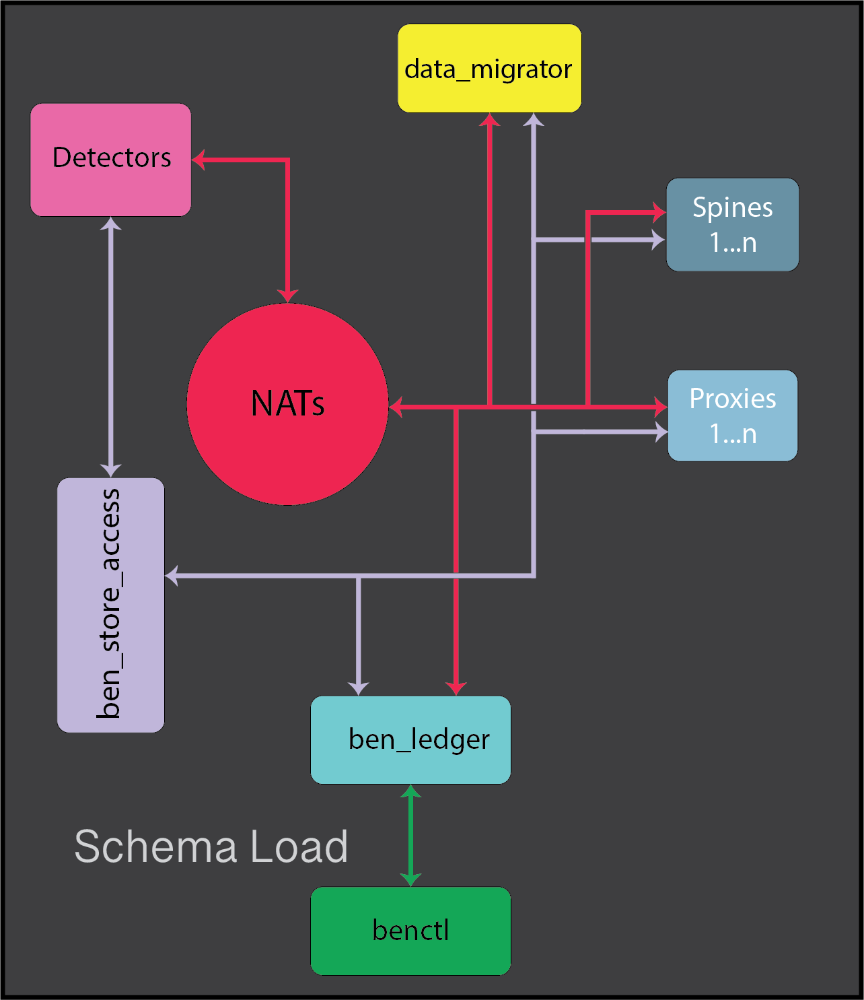

# Schema Load Flow

#### Components used:
- [benctl](../components/benctl.md)
- [ben_ledger](../components/ben_ledger.md)
- [ben_store_access](../components/ben_store_access.md)
- [proxies](../components/proxies.md)
- [spines](../components/spines.md)
- [data_migrator](../components/data_migrator.md)
- [detectors](../components/detectors.md)

---

## Part 1: The Flow  

### What This Flow Explains

This flow explains how **user-declared intent** is introduced, staged, distributed, and activated within the Ben system.

It visualizes the lifecycle of schemas, policy packs, and related contracts as they move from human declaration through system-wide activation, emphasizing versioning, explicit coordination, and failure visibility.

This flow represents the **intent hydration path** of Ben.

---

### Steps of the Flow

1. **User declares intent via code and `benctl`**  
   The user defines schemas, policy packs, rules, and contracts in code, expressing intent explicitly.

2. **`benctl` builds intent and stages it in `ben_ledger`**  
   Declared intent is compiled, validated, and staged. No deployment occurs at this stage.

3. **`benctl` deploys intent into the Ben system**  
   Deployment is an explicit action. Nothing is implicitly activated.

4. **`ben_ledger` stores and keys declared intent via `ben_store_access`**  
   Intent artifacts are stored, and stable keys are generated for retrieval.

5. **`ben_store_access` returns keys to `ben_ledger`**  
   Keys reference immutable or versioned intent artifacts rather than raw payloads.

6. **`ben_ledger` versions intent and emits notifications via NATS**  
   Versioned intent updates are announced to relevant system components.

7. **Components receive keys via NATS and connect to `ben_store_access`**  
   Components do not receive intent directly-only references to it.

8. **`ben_store_access` streams data to components**  
   Components retrieve the intent artifacts they require.

9. **Components hot-swap policy packs using atomic mechanisms**  
   Policy packs are swapped in-memory (e.g., via `ArcSwap`) without halting execution.

10. **Components acknowledge successful activation back to `ben_ledger`**  
    Each component explicitly reports successful adoption of the new intent version.

11. **`ben_ledger` finalizes versioning**  
    Once all required acknowledgements are received, the version is considered active.

12. **`ben_ledger` exposes status and logs via `benctl`**  
    The user receives explicit feedback through the CLI, including failures or partial success.

---

### Summary

This flow establishes a clear boundary between **declared intent**, **distribution**, and **activation**.

Intent is never pushed blindly, never assumed to be active, and never hidden behind opaque state. Every step is explicit, versioned, and observable.

---

## Part 2: Failure and Stress  

### Failure Modes

Possible failure modes include:

- No network connectivity between components  
- Incorrect addresses or configuration  
- Catastrophic failure during a hot-swap  
- Partial activation (e.g., some spines or proxies fail to switch)  
- Incorrect or missing key retrieval  
- Drift caused by incomplete or failed deployment  

---

### Observed Consequences

- Policy packs may be temporarily out of sync across components  
- Existing behavior continues under previous intent versions  
- Retries are attempted where appropriate  
- Failures are explicit, bounded, and visible to operators  
- No silent partial activation occurs  

---

### Open Questions / Unclear Areas

- How to ensure *all* required components successfully switch before finalizing a version  
- Whether intent artifacts should be streamed individually to each component or daisy-chained  
- How to minimize network usage during large fan-out updates  
- Whether historical intent versions should influence activation decisions  

---

### Pain Points

- Coordinating activation across *N* components without introducing hidden consensus  
- Preventing drift when some components fail deployment  
- Defining rollback and fallback semantics  
- Managing historical version metadata for auditing or recovery  
- Ensuring deployment feedback is precise without becoming overwhelming  

---

### Closing Note

Schema load is intentionally conservative.

Ben prefers delayed correctness over silent inconsistency.  
Activation happens only when the system can *prove* it happened.

This flow makes failure visible and survivable by design.