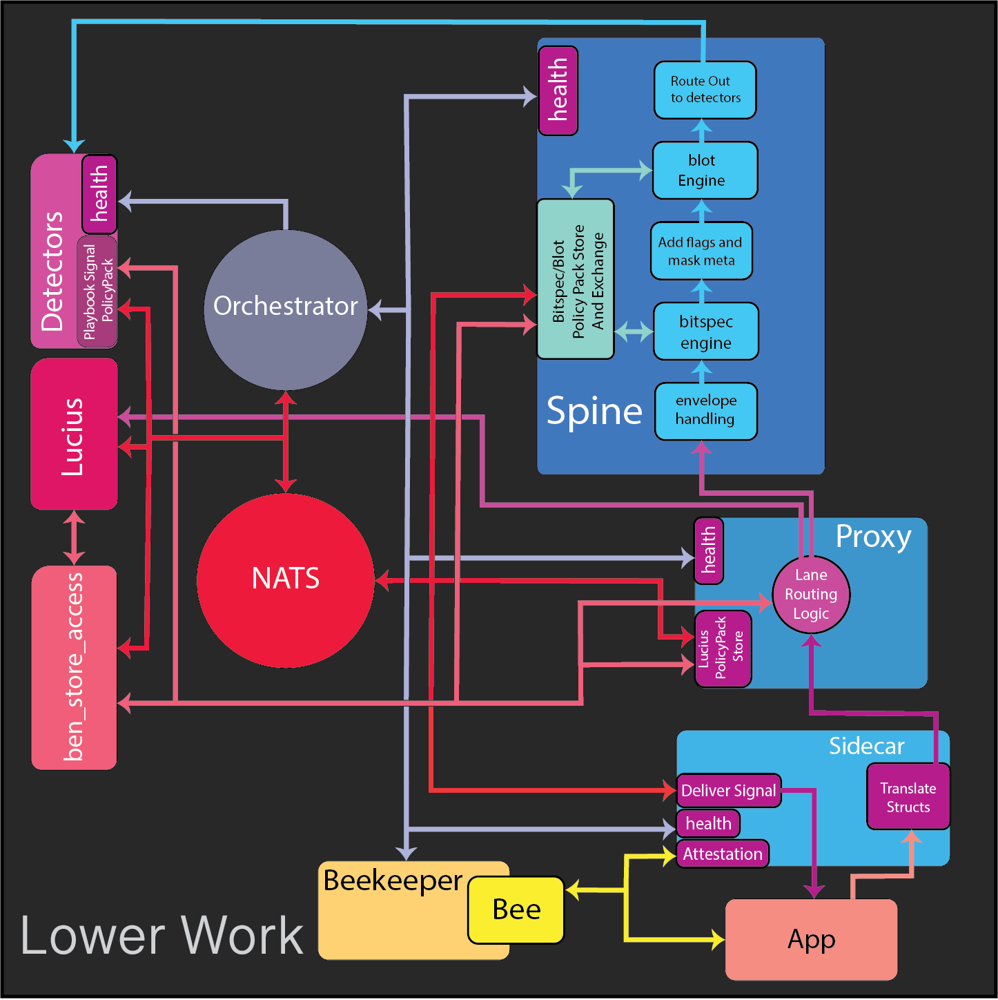

# Lower Work Flow  
*(Application → Detector)*

#### Components used
- [bee_beekeeper](../components/bee_beekeeper.md)
- [sidecars](../components/sidecars.md)
- [proxies](../components/proxies.md)
- [spines](../components/spines.md)
- [detectors](../components/detectors.md)
- [ben_store_access](../components/ben_store_access.md)
- [orchestrator](../components/orchestrator.md)
- [lucius](../components/lucius.md)

---

## Part 1: The Flow  

### What This Flow Explains

This flow explains how data moves from applications into the Ben system and ultimately to detectors, while explicitly denoting where policy, intent, and action are applied.

The goal of this flow is to **not hide complexity**, while also avoiding drowning the reader in unnecessary detail. It surfaces where decisions happen, where enforcement occurs, and where execution is purely mechanical.

---

### Steps of the Flow

1. **Attestation occurs between the application and sidecar**  
   A secure relationship is established between the app and the Ben system via BEE and Beekeeper.
   [bee deepdive](../deepdives/bee_deepdive.md)

2. **Sidecar translates application-specific structures into Ben global schemas**  
   Translation occurs at the boundary so internal components operate on a unified data model.

3. **Sidecar forwards translated data to the proxy**  
   The sidecar does not evaluate intent or rules.

4. **Proxy routes data based on declared intent**  
   Depending on configuration, data is routed either toward Lucius or toward a spine.

5. **Spine handles envelope processing**  
   Structural handling and normalization occurs before evaluation.

6. **Spine evaluates Bitspec rules against declared, versioned policy packs**  
   Rules are applied deterministically using the Bitspec engine.

7. **Spine adds flags and metadata based on rule evaluation**  
   Metadata is encoded via bitmasking to preserve structure and meaning.

8. **Spine applies redaction via the Blot engine**  
   Redaction occurs before downstream analysis.

9. **Spine routes processed data to detectors**  
   Data now carries metadata, flags, and redaction consistent with declared intent.

10. **Detectors consume metadata and flags**  
    Detectors reason over the enriched data without reinterpreting raw input.

11. **Detectors evaluate playbooks and emit signals if triggered**  
    Signals are generated strictly from declared intent and emitted via NATS.

12. **Sidecar receives signals and delivers them to the application**  
    Delivery is mechanical. The sidecar does not originate signals.

13. **Data continues through the system as required**  
    Processed data may loop back through proxies and spines for additional handling or observation.

---

### Orchestrator Flow

The orchestrator establishes and manages system components in the following general order:

1. Detectors  
2. Spines  
3. Proxies  
4. Sidecars (with BEE handoff for attestation)

The orchestrator:
- Receives periodic health information from components
- Performs service discovery
- Spins components up or down based on system conditions
- Generally avoids scaling detectors aggressively due to cost

The orchestrator does **not** interpret telemetry, intent, or policy.

---

### Summary

This writeup focuses on runtime data flow and policy enforcement.

Schema loading and intent declaration are shown only to avoid hiding complexity, but are not the focus of this flow.

The diagram illustrates how lower-level components work together in a cohesive, intent-driven system.

---

## Part 2: Failure and Stress  
*(What happens when reality intrudes)*

### Failure Modes

Potential failure modes include:

- Explicit policy pack drift
- Ephemeral component churn caused by bursty traffic
- Misaligned declared intent leading to unintended behavior
- Catastrophic system failure requiring rebuild
- Application-level disconnections
- Incoming structures not covered by declared intent
- Bad health data influencing orchestrator decisions
- Misaligned playbooks or signals
- Bottlenecks in Blot redaction
- Bottlenecks in `ben_store_access`
- Misalignment between Lucius and core system data
- Lucius throughput limitations
- Latency in NATS signal delivery
- Beekeeper failure or incomplete BEE lifecycle execution

---

### Observed Consequences

- Component failures may cascade upward through the system
- Version mismatches are explicit and observable
- Unintended behavior is treated as degraded operation
- Catastrophic failure requires only a minimal set of components to recover
- All failures, unintended actions, and system health remain visible and explainable

---

### Open Questions / Unclear Areas

- What constitutes “bursty traffic”
- How granular lifecycle metrics should be
- Whether NATS latency is sufficient for signal delivery
- How to simplify coordination if NATS latency becomes problematic
- Required latency bounds for Lucius
- The minimal coupling needed for maximal system effect

---

### Places Needing More Thought

- Can this design be simplified further without hiding responsibility?