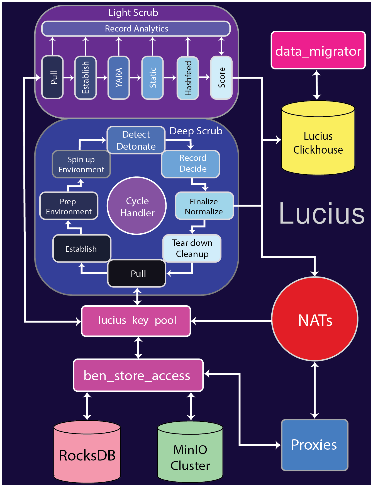

# Lucius Flow

#### Components used:
- [lucius](../components/lucius.md)
- [data migrator](../components/data_migrator.md)
- [ben_store_access](../components/ben_store_access.md)
- [proxies](../components/proxies.md)

## Part 1: The Flow 

### What This Flow Explains

This flow explains what happens to data when it enters **Lucius**.  
It documents the two sanitization paths, **Light Scrub** and **Deep Scrub**, as well as Lucius’s ingress and egress mechanics.

Lucius is intentionally isolated from the hot path of the Ben system and is designed to perform expensive, repeated, and high-risk analysis without blocking system operation.

---

### Steps of the Flow

#### Overall Flow

1. Data is routed from proxies into **ben_store_access**.
2. **ben_store_access** generates keys for the **lucius_key_pool**.
3. **Light Scrub** and **Deep Scrub** pull keys from the key pool and retrieve blob data from MinIO via **ben_store_access**.
4. Data is enriched and appended to **Lucius ClickHouse**, which is later pulled from by **data_migrator**.
5. Data that is marked as safe exits Lucius as keys via **NATS**, where proxies can retrieve it for reintegration into the main system.

---

#### Deep Scrub Flow

1. A key is pulled from **lucius_key_pool**.
2. Data is retrieved from **ben_store_access**.
3. Deep Scrub establishes what it is inspecting and what behavior is expected.
4. Deep Scrub prepares the environment through scaffolding.
5. A detonation environment is spun up.
6. Detonation behavior is observed.
7. Analytics are recorded.
8. Actions are finalized and data is normalized for output.
9. The VM environment is torn down and cleaned up.

The **Cycle Handler** remains in contact with every stage to handle errors, retries, and resets.

---

#### Light Scrub Flow

1. Light Scrub pulls a key from the key pool.
2. Light Scrub establishes what it is inspecting.
3. YARA rules are applied.
4. Static analysis is performed.
5. Hashes are checked against threat feeds.
6. A score is generated.
7. Data is written to Lucius ClickHouse and safe data is emitted via **NATS** for proxies to retrieve.

Lucius ClickHouse data is later accessed through **data_migrator**.

---

### Summary

- **Light Scrub** is the highly extensible, open-core path for Lucius.
  - Supports interchangeable YARA rules, static analysis tooling, and threat feeds.
- **Deep Scrub** is the closed-source VM orchestration, detonation, and honeypot engine for deeper inspection.
- Safe data and malicious data are strictly separated:
  - Safe data is reintegrated.
  - Malicious data is quarantined.
- Lucius remains **off the hot path** and never blocks primary system operation.

---

## Part 2: Failure and Stress (what happens when reality intrudes)

### Failure Modes

- Catastrophic failure causing Lucius to become inert.
- Unintended behavior due to poorly declared or outdated intent.
- Threat feeds becoming malicious, unreachable, or acting as choke points.
- Resource exhaustion caused by VM orchestration overhead.
- Lack of organization-specific metrics leading to poor prioritization.
- **lucius_key_pool** becoming out of sync.
- False positives or false negatives.
- Reintegration of unsafe data.
- Compounding behavior caused by multiple sanitization passes.

---

### Observed Consequences

- False negatives can lead to breaches.
- Deep Scrub loops can over-consume resources and effectively DoS parts of the system.
- Misaligned intent leads to degraded security posture.
- Excessive isolation can reduce operational usefulness if not carefully bounded.

---

### Open Questions / Unclear Areas

- How much extensibility should Lucius allow?
- Where is flexibility beneficial versus dangerous?
- Should Lucius allow users to use untrusted or poor-quality threat feeds?
- What criteria justify prohibiting certain feeds or tools?
- What is the holistic purpose of scoring?
- When and how should malicious data be retained or purged?
- How much malicious data should be exposed for forensic purposes?
- Is being “good enough” 99% of the time acceptable?
- How do we allow tooling integration without trying to do everything?
- How much latitude should users have to make mistakes?

---

### Pain Points

- Resource utilization and cost.
- Clear delineation between open-core and closed-source functionality.
- Coordinating in-house tooling with third-party tools.
- Deciding what should be built internally versus integrated externally.